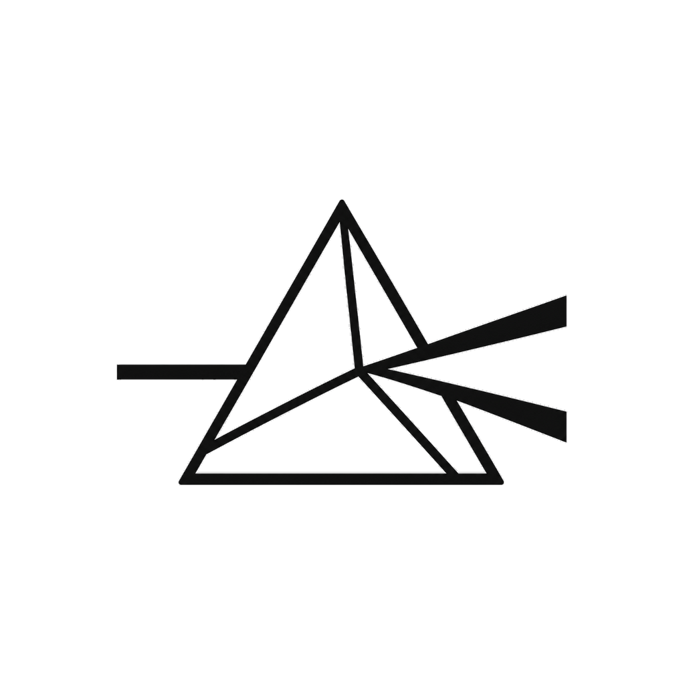
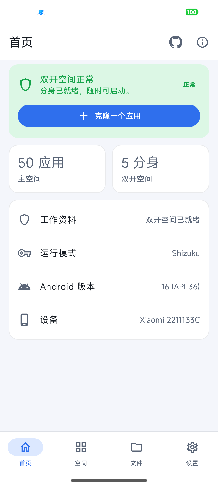
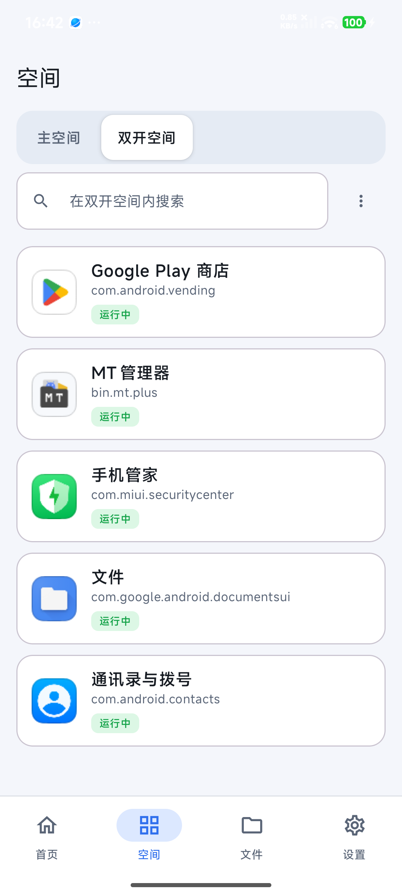
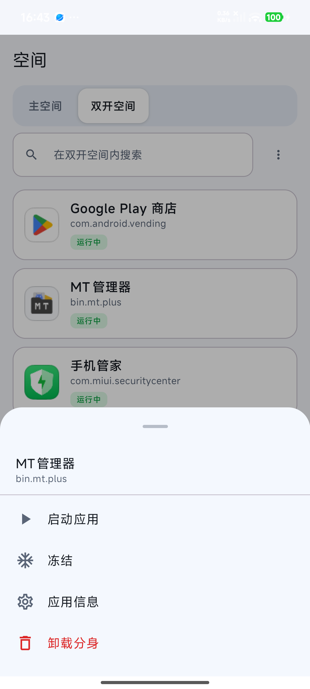
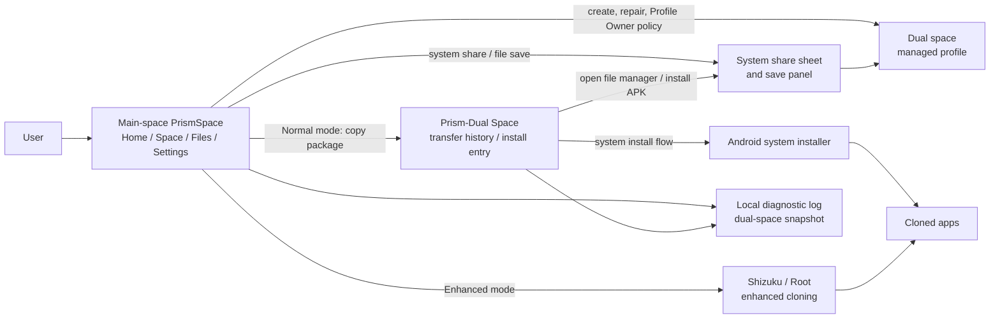

[简体中文](README.md) · **English**

# PrismSpace

**Lightweight, native app cloning powered by Android Work Profile**

PrismSpace creates a truly isolated dual space at the system level — app data, accounts and storage are fully separated with better compatibility and zero runtime overhead. Built on Android's native work-profile capability, it takes a fundamentally different approach from virtualization-based solutions like Parallel Space. It supports Normal, Shizuku and Root run modes.

<table>
<tr>
<td></td>
<td></td>
<td></td>
</tr>
<tr>
<td align="center">Home: space status and primary actions</td>
<td align="center">Space: main/dual app lists</td>
<td align="center">Action sheet: launch, freeze, uninstall</td>
</tr>
</table>

## ✨ Features

🔒 **System-Level Isolation** — Built on Android managed profiles. The main space and dual space are two independent system user environments with fully separated data — not in-process virtualization.

📦 **No Root Required** — Normal mode works out of the box: create the space, clone apps, manage twins and transfer files. Root and Shizuku are optional enhancements.

⚙️ **Full App Management** — Clone, launch, freeze, unfreeze and uninstall app twins. Automatically handles multi-module packages. One-stop management for all your cloned apps.

📂 **Cross-Space File Transfer** — Move files between the main space and dual space through the system share sheet, with the system save panel writing into the target space.

⚡ **Lightweight & Native** — Apps run directly inside a system-level profile with no virtualization runtime overhead. Compatibility matches a native install.

## 🚀 Quick Start

1. Download and install the APK from [Releases](https://github.com/yzddmr6/PrismSpace/releases).
2. Open PrismSpace and follow the setup wizard to create the dual space (Android work-profile flow).
3. Open the Space tab and choose an app to clone from the main space.
4. In Normal mode the complete package syncs to the dual space; tap Install in Prism-Dual Space and confirm.
5. Once installed, use the Space tab to launch, freeze or uninstall the cloned app.

To build from source, see [CONTRIBUTING.md](CONTRIBUTING.md).

## Run Modes

All three modes can launch, freeze, uninstall cloned apps and transfer files across spaces. The difference is in how apps are cloned and what space-maintenance tools are available:

- **Normal** — Copies the complete package to the dual space; the user confirms through the system installer. Zero prerequisites, no extra permissions needed.
- **Shizuku / ADB** — Clones automatically after authorization, no manual install confirmation required.
- **Root** — Automatic cloning + can assist with creating, repairing and deleting the dual space.

## Architecture At A Glance

The main app orchestrates everything. Profile Owner code applies system policy inside the dual space. Android's own system UI handles install, share and file-save confirmations.

## FAQ

**What are the device requirements?**

Android 7.0 or above. The device must not already have another work profile or work space (Android allows only one work profile per user). Root or an unlocked bootloader is not required.

**Do I need Root or Shizuku?**

No. Normal mode handles the full workflow: creating the space, cloning apps, transferring files and installing. Shizuku/Root add automatic cloning and other enhancements.

**What if space creation fails?**

Some device manufacturers restrict the work-profile feature. Make sure no other work space is already active, then use Settings → Export diagnostic logs and attach the output to your issue report.

**How do I export debugging information?**

Settings → Export diagnostic logs, then share the text attachment. It includes diagnostic snapshots for both the main and dual spaces.

## Contributing

Issues and PRs are welcome. See [CONTRIBUTING.md](CONTRIBUTING.md) for development and build instructions.

## 📖 Further Reading

- [PrismSpace: The 4-Billion-Token Android Dual-Space Rebuild](https://mp.weixin.qq.com/s/NSQOABIqwg6seNOwmBfhrQ) (in Chinese)

## License

PrismSpace is distributed under the **GNU General Public License v3.0**, see [LICENSE](LICENSE).

## Credits

This project is **rebuilt** from [Island](https://github.com/oasisfeng/island) by Oasis Feng and contributors. Thanks also to [Shelter](https://github.com/PeterCxy/Shelter), [Insular](https://gitea.angry.im/PeterCxy/Insular), [Shizuku](https://shizuku.rikka.app/) and AndroidX / Jetpack Compose.

## 💬 Contact & Feedback

For bug reports or technical discussion, follow the WeChat public account:

