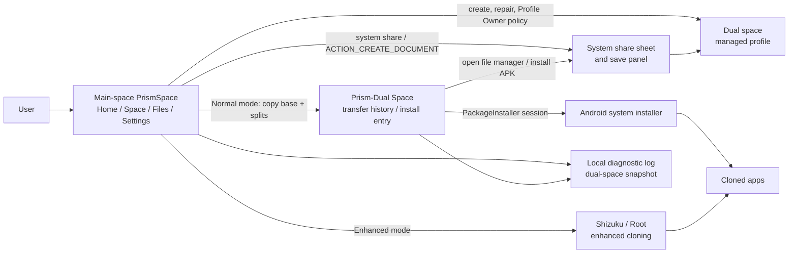

[简体中文](README.md) · **English**

# PrismSpace

**An Android work-profile app-cloning manager. It uses system-level isolation to create a separate space, then installs, runs and manages your app clones.**

PrismSpace places app copies inside Android's native **managed profile / work profile**. The main space and the dual space are two system user environments, so app data, accounts, storage and package state are isolated. The main-space PrismSpace orchestrates everything and offers the Normal / Shizuku / Root run modes; the Profile Owner inside the dual space applies system policy: space creation, system-component enablement, app launch/freeze and APK synchronization. Cross-space file transfer goes through the system share sheet.

<table>
<tr>
<td></td>
<td></td>
<td></td>
</tr>
<tr>
<td align="center">Home: space status, run mode and primary action</td>
<td align="center">Space: main/dual app lists</td>
<td align="center">Action sheet: launch, freeze, uninstall and app info</td>
</tr>
</table>

## What It Is

PrismSpace uses Android's official work-profile capability and installs cloned apps into a separate profile.

- **Main space**: the user's normal personal space and the home of the full PrismSpace UI.
- **Dual space**: an Android managed profile that runs cloned apps and stores their isolated data.
- **Prism-Dual Space**: the visible profile-side entry for transfer history, guidance on sending files back to the main space, and Normal-mode foreground install.
- **Normal mode**: PrismSpace copies the full APK set and the user confirms through Android's system installer.
- **Enhanced modes**: Shizuku or Root can provide automatic cloning and selected space-maintenance tools after authorization.

## Architecture At A Glance

The main app manages and orchestrates. Profile Owner code applies system policy in the dual space. Android's system UI handles key install, share and file-save confirmations.

## Features

- **App cloning**: clone main-space apps into the dual space with separate account and data state.
- **System-level isolation**: built on Android managed profiles — real OS-level isolation, not in-process virtualization, so main-space and dual-space app data never mix.
- **App management**: launch, freeze, unfreeze, uninstall twins, and open system app-info pages.
- **Visible system apps**: system apps are shown by default because file, install, browser and settings flows depend on them.
- **Normal install**: copy the complete APK set, then confirm installation in the dual space with the system installer.
- **Shizuku/Root enhancement**: after authorization, automatically clone installed packages and use selected maintenance tools.
- **File transfer**: use the system share sheet to choose Personal/Work, then the system save panel to write into the target space.
- **Local diagnostics**: export a 2 MiB rolling log, system snapshot, dual-space snapshot and filtered logcat.
- **Update check**: fetch newer release information from GitHub Releases.
- **PrismProbe**: companion verifier for files, permissions, notifications, background behavior and networking inside the dual space.

Core space-management, install and file-transfer flows run locally on the device. Update checks, PrismProbe network tests and diagnostic sharing only run when the user triggers them.

## Quick Start

1. Download and install the APK from [Releases](https://github.com/yzddmr6/PrismSpace/releases).
2. Open PrismSpace and follow Android's work-profile provisioning flow to create the dual space.
3. Open the Space tab, switch to the main-space list, and choose an app to clone.
4. In Normal mode, PrismSpace syncs the full installer into the dual space; tap Install in Prism-Dual Space and confirm in the system installer.
5. After installation, use the Space tab to launch, freeze or uninstall the cloned app.

To build from source, see [CONTRIBUTING.md](CONTRIBUTING.md).

## Run Modes And Capability Matrix

| Capability | Normal | Shizuku / ADB | Root |
| --- | --- | --- | --- |
| Create the dual space | System work-profile flow | Same as Normal | Can assist creation/repair |
| Launch, freeze, unfreeze, uninstall twins | Supported | Supported | Supported |
| Clone system apps | Enable system app in the dual space | Same as Normal | Same as Normal |
| Clone ordinary user apps | Copy complete APK set, user confirms install | Automatic clone for installed apps | Automatic clone for installed apps |
| Split APKs | Prism-Dual Space installs the complete set | Complete set included automatically | Complete set included automatically |
| External APK tap | Handled by Android's system installer UI | Same as Normal | Same as Normal |
| Delete/recreate space | System-guided path | Same as Normal | Enhanced delete/create path |

Normal mode is suitable for everyday use without extra authorization. Shizuku and Root modes are for users who want fewer manual steps or additional maintenance tools.

## Normal Install Flow

Normal mode follows Android's standard install flow:

1. PrismSpace collects the source app's base APK and split APKs from the main space.
2. The complete set is copied into the dual space and recorded in both spaces' transfer histories.
3. The user can find the APK from the PrismSpace Files tab, Prism-Dual Space, the system file manager or MT Manager.
4. A single APK opens Android's system installer UI. If Android asks to allow this install source, grant it and continue.
5. A split APK set continues from the Install action in Prism-Dual Space, then Android shows the final installer confirmation.

## Files And Diagnostics

Cross-space file transfer uses the system share sheet. The user shares a file from the source app, chooses the Personal or Work tab, then selects "Import into this space PrismSpace". The receiving side immediately reads the granted URI, copies it to a temporary file, and uses `ACTION_CREATE_DOCUMENT` so the user chooses the final save location.

The Files tab and Prism-Dual Space both show transfer history for their own user space. Tapping a record opens the system file manager; APK records add a separate Install action so split APK sets are not treated as a single file.

Diagnostics are exported only when the user chooses to share them. The shared text attachment contains the current space's 2 MiB rolling log, system information, a dual-space snapshot and filtered logcat lines related to install, file and space-state flows.

## FAQ

**Do I need Root or Shizuku?**

Not for the core flow. Normal mode can create the dual space, manage cloned apps, transfer files and install apps. Shizuku/Root adds automatic cloning and selected maintenance tools.

**How do I install split apps?**

Use the Install action in Prism-Dual Space. PrismSpace passes the base APK and splits together to Android's installer confirmation.

**How do I export debugging information?**

Use Settings -> Export diagnostic logs. The shared attachment includes diagnostic snapshots for the main and dual spaces and is suitable for issue reports.

## Contributing

Issues and PRs are welcome. See [CONTRIBUTING.md](CONTRIBUTING.md) for development and build instructions.

## Licensing

PrismSpace is distributed under the **GNU General Public License v3.0**, see [LICENSE](LICENSE).

## Credits

Built on [Island](https://github.com/oasisfeng/island) by Oasis Feng and contributors. Thanks also to [Shelter](https://github.com/PeterCxy/Shelter), [Insular](https://gitea.angry.im/PeterCxy/Insular), [Shizuku](https://shizuku.rikka.app/) and AndroidX / Jetpack Compose.

---

For use on devices you own or are authorized to manage. This software is provided as-is under the GPL, with no warranty.
