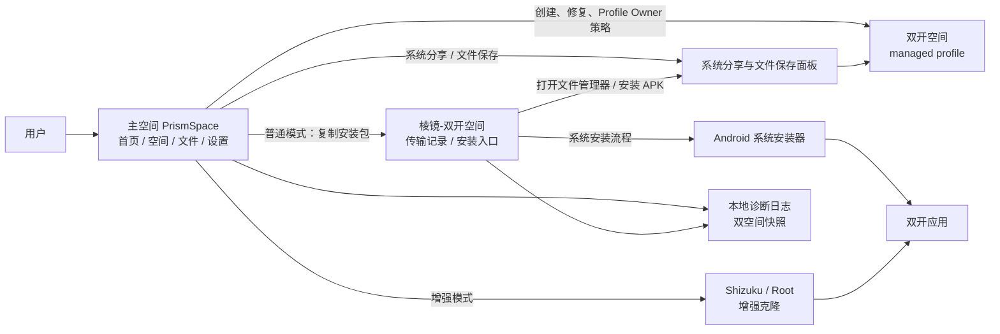

**简体中文** · [English](README.en.md)

# PrismSpace · 棱镜空间

**基于 Android 工作资料，轻量原生的应用双开方案**

PrismSpace 在系统层面创建真正隔离的双开空间——应用数据、账号、存储完全分开，兼容性更好，性能无额外开销。基于 Android 原生工作资料能力实现，不同于平行空间等虚拟化方案。支持普通、Shizuku、Root 三种运行模式。

<table>
<tr>
<td></td>
<td></td>
<td></td>
</tr>
<tr>
<td align="center">首页：空间状态与主操作</td>
<td align="center">空间：主空间/双开空间应用列表</td>
<td align="center">操作面板：启动、冻结、卸载</td>
</tr>
</table>

## ✨ 特点

🔒 **系统级隔离** — 基于 Android managed profile，主空间和双开空间是两个独立的系统用户环境，数据彼此不可见，不是进程内虚拟化。

📦 **无需 Root 即可使用** — 普通模式零门槛，创建空间、克隆应用、管理分身、传输文件全部可用。Root 和 Shizuku 是可选增强。

⚙️ **完整的应用管理** — 克隆、启动、冻结、解冻、卸载应用分身，自动处理多模块安装包，一站式管理双开应用。

📂 **跨空间文件互传** — 通过系统分享面板在主空间和双开空间之间传输文件，由系统保存面板写入目标空间。

⚡ **轻量原生** — 应用直接运行在系统级 profile 中，无虚拟化运行时开销，兼容性与原生安装一致。

## 🚀 快速上手

1. 从 [Releases](https://github.com/yzddmr6/PrismSpace/releases) 下载 APK 并安装。
2. 打开 PrismSpace，按引导创建双开空间（Android 工作资料流程）。
3. 在「空间」页选择主空间中要克隆的应用。
4. 普通模式下，完整安装包会同步到双开空间；在「棱镜-双开空间」中点击安装并确认。
5. 安装完成后，从「空间」页启动、冻结或卸载双开应用。

从源码构建请见 [CONTRIBUTING.md](CONTRIBUTING.md)。

## 运行模式

三种模式都可以启动、冻结、卸载双开应用和跨空间传输文件，区别在于应用克隆方式和空间维护能力：

- **普通模式** — 复制完整安装包到双开空间，用户在系统安装器中确认安装。零门槛，无需额外权限。
- **Shizuku / ADB 模式** — 授权后自动克隆，无需手动确认安装。
- **Root 模式** — 自动克隆 + 可辅助创建、修复和删除双开空间。

## 架构速览

主应用负责管理和编排；双开空间内的 Profile Owner 执行系统策略；安装、分享、文件保存等操作交给 Android 系统界面完成。

## FAQ

**对设备有什么要求？**

Android 7.0 及以上系统。设备上不能已有其他工作资料或工作空间（Android 限制每个用户只能有一个工作资料）。不需要 Root 或解锁 Bootloader。

**一定要 Root 或 Shizuku 吗？**

不需要。普通模式可以完成创建空间、克隆应用、文件传输和安装的全部流程。Shizuku/Root 提供自动克隆等增强能力。

**空间创建失败怎么办？**

部分设备厂商限制了工作资料功能。请确认设备没有已激活的其他工作空间，然后在设置 → 导出诊断日志中获取详细信息，随 issue 一起提交以便排查。

**如何导出排错信息？**

设置 → 导出诊断日志，分享文本附件即可。附件包含主空间和双开空间的诊断快照。

## 贡献

欢迎 Issue 与 PR。开发与构建说明见 [CONTRIBUTING.md](CONTRIBUTING.md)。

## 📖 相关阅读

- [PrismSpace：40亿token的安卓双开重构之路](https://mp.weixin.qq.com/s/NSQOABIqwg6seNOwmBfhrQ)

## 许可

PrismSpace 以 **GNU GPL v3.0** 分发，见 [LICENSE](LICENSE)。

## 致谢

本项目基于 Oasis Feng 及贡献者的 [Island](https://github.com/oasisfeng/island) **重构**而来。同时感谢 [Shelter](https://github.com/PeterCxy/Shelter)、[Insular](https://gitea.angry.im/PeterCxy/Insular)、[Shizuku](https://shizuku.rikka.app/) 以及 AndroidX / Jetpack Compose。

## 💬 交流与反馈

问题反馈或技术交流，欢迎关注公众号：

