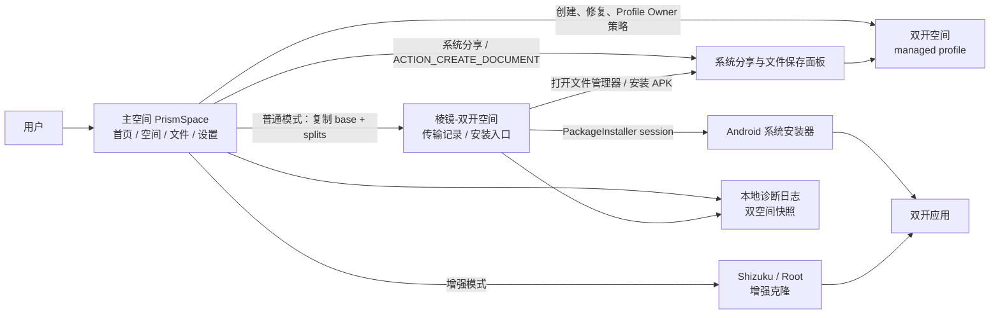

**简体中文** · [English](README.en.md)

# PrismSpace · 棱镜空间

**基于 Android 工作资料的应用双开管理器。用系统级隔离创建独立空间，安装、运行和管理应用分身。**

PrismSpace 把应用副本放进 Android 原生 **managed profile / 工作资料**。主空间和双开空间是两个系统用户环境，数据、账号、存储和应用状态彼此隔离。主空间的 PrismSpace 负责编排，并提供普通、Shizuku、Root 三种运行模式；双开空间内的 Profile Owner 执行系统策略：创建空间、启用系统组件、启动/冻结应用、同步安装包。跨空间文件传输交给系统分享面板完成。

<table>
<tr>
<td></td>
<td></td>
<td></td>
</tr>
<tr>
<td align="center">首页：空间状态、运行模式和主操作</td>
<td align="center">空间：主空间/双开空间应用列表</td>
<td align="center">操作面板：启动、冻结、卸载和应用信息</td>
</tr>
</table>

## 是什么

PrismSpace 使用 Android 官方工作资料能力，把双开应用安装到独立 profile 中。

- **主空间**：用户日常使用的个人空间，也是完整 PrismSpace 主界面所在位置。
- **双开空间**：Android managed profile，运行应用分身并保存独立数据。
- **棱镜-双开空间**：双开空间里的可见入口，提供传输记录、把文件传回主空间的操作指引，以及普通模式前台安装。
- **普通模式**：复制完整 APK 套件后，由用户在系统安装器里确认安装。
- **增强模式**：启用 Shizuku 或 Root 后，可使用自动克隆和空间维护等增强能力。

## 架构速览

主应用负责管理和编排；双开空间里的 Profile Owner 执行系统策略；安装、分享、文件保存等关键操作交给 Android 系统界面完成。

## 功能

- **应用双开**：把主空间应用克隆到双开空间，形成独立账号和独立数据的应用副本。
- **系统级隔离**：依托 Android managed profile，是真正的系统级隔离而非进程内虚拟化，主空间和双开空间的应用数据互不共享。
- **应用管理**：启动、冻结、解冻、卸载分身，打开系统应用信息页。
- **系统应用可见**：主空间和双开空间默认展示系统应用，便于处理文件、安装、浏览器、设置等关键链路。
- **普通安装**：复制完整 APK 套件，在双开空间前台用系统安装器确认安装。
- **Shizuku/Root 增强**：授权后可自动克隆已安装应用，并提供部分空间维护能力。
- **文件传输**：通过系统分享面板选择个人/工作空间，再用系统保存面板写入目标空间。
- **本地诊断**：导出 2 MiB 滚动日志、系统快照、双开空间快照和筛选 logcat，便于定位安装与 profile 问题。
- **检查更新**：通过 GitHub Releases 获取新版信息。
- **PrismProbe**：独立验证应用，用于检查双开空间中的文件、权限、通知、后台和网络行为。

核心空间管理、安装和文件传输流程在设备本地完成；检查更新、PrismProbe 网络测试和诊断分享只在用户主动触发时发起。

## 快速上手

1. 从 [Releases](https://github.com/yzddmr6/PrismSpace/releases) 下载 APK 并安装。
2. 打开 PrismSpace，按系统工作资料流程创建双开空间。
3. 在“空间”页切换到主空间，选择要克隆的应用。
4. 普通模式下，PrismSpace 会把完整安装包同步到双开空间；随后在“棱镜-双开空间”里点“安装”，并在系统安装器里确认。
5. 安装完成后，从“空间”页启动、冻结或卸载双开应用。

从源码构建请见 [CONTRIBUTING.md](CONTRIBUTING.md)。

## 运行模式与能力矩阵

| 能力 | 普通模式 | Shizuku / ADB | Root |
| --- | --- | --- | --- |
| 创建双开空间 | 系统工作资料流程 | 同普通模式 | 可辅助创建/修复 |
| 启动、冻结、解冻、卸载分身 | 支持 | 支持 | 支持 |
| 系统应用双开 | 启用双开空间内系统应用 | 同普通模式 | 同普通模式 |
| 普通用户应用克隆 | 复制完整 APK 套件，用户确认安装 | 自动克隆已安装应用 | 自动克隆已安装应用 |
| split APK | 双开空间安装入口处理完整套件 | 自动包含完整套件 | 自动包含完整套件 |
| 外部 APK 点击 | 交给系统安装界面处理 | 同普通模式 | 同普通模式 |
| 删除/重建空间 | 系统引导路径 | 同普通模式 | 增强删除/创建 |

普通模式适合不启用额外权限的日常使用；Shizuku 和 Root 模式适合希望减少手动步骤或需要空间维护能力的用户。

## 普通安装链路

普通模式按 Android 标准安装流程工作：

1. PrismSpace 从主空间源应用收集 base APK 和 split APK。
2. 文件同步到双开空间的 PrismSpace 下载区域，并写入主空间和双开空间传输记录。
3. 用户可以从 PrismSpace 文件页、双开空间入口、系统文件管理器或 MT 管理器找到 APK。
4. 单 APK 会进入系统安装界面；如果系统提示允许此来源安装应用，按提示授权后返回继续。
5. split 套件从“棱镜-双开空间”的安装按钮进入完整套件安装流程，再由系统安装器确认。

## 文件与诊断

跨空间文件传输使用系统分享面板。用户在来源应用中点“分享”，在系统面板选择“个人 / 工作”目标空间，再选择“导入到此空间 PrismSpace”。接收方会立即读取系统授予的 URI，复制到临时文件，然后用 `ACTION_CREATE_DOCUMENT` 让用户选择最终保存位置。

文件页和“棱镜-双开空间”都显示本空间的传输记录。点击记录默认打开系统文件管理器；APK 记录额外提供“安装”动作，避免把 split 套件误当成单 APK 打开。

诊断由用户主动导出。导出的文本附件包含当前空间 2 MiB 滚动日志、系统信息、双开空间快照和与安装、文件、空间状态相关的 logcat 片段。

## FAQ

**一定要 Root 或 Shizuku 吗？**

不一定。普通模式可以完成创建空间、管理分身、文件传输和应用安装。Shizuku/Root 可用于自动克隆和部分空间维护。

**split 应用怎么安装？**

从“棱镜-双开空间”的安装按钮继续，PrismSpace 会把 base APK 和 splits 一起交给系统安装器确认。

**如何导出排错信息？**

在“设置 → 导出诊断日志”分享文本附件。附件包含主空间和双开空间的诊断快照，适合随 issue 一起提交。

## 贡献

欢迎 Issue 与 PR。开发与构建说明见 [CONTRIBUTING.md](CONTRIBUTING.md)。

## 许可

PrismSpace 以 **GNU GPL v3.0** 分发，见 [LICENSE](LICENSE)。

## 致谢

基于 Oasis Feng 及贡献者的 [Island](https://github.com/oasisfeng/island)。同时感谢 [Shelter](https://github.com/PeterCxy/Shelter)、[Insular](https://gitea.angry.im/PeterCxy/Insular)、[Shizuku](https://shizuku.rikka.app/) 以及 AndroidX / Jetpack Compose。

---

仅用于你拥有或被授权管理的设备。本软件按 GPL 原样提供，不附带任何担保。
